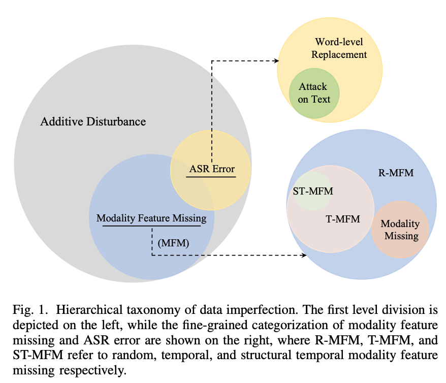
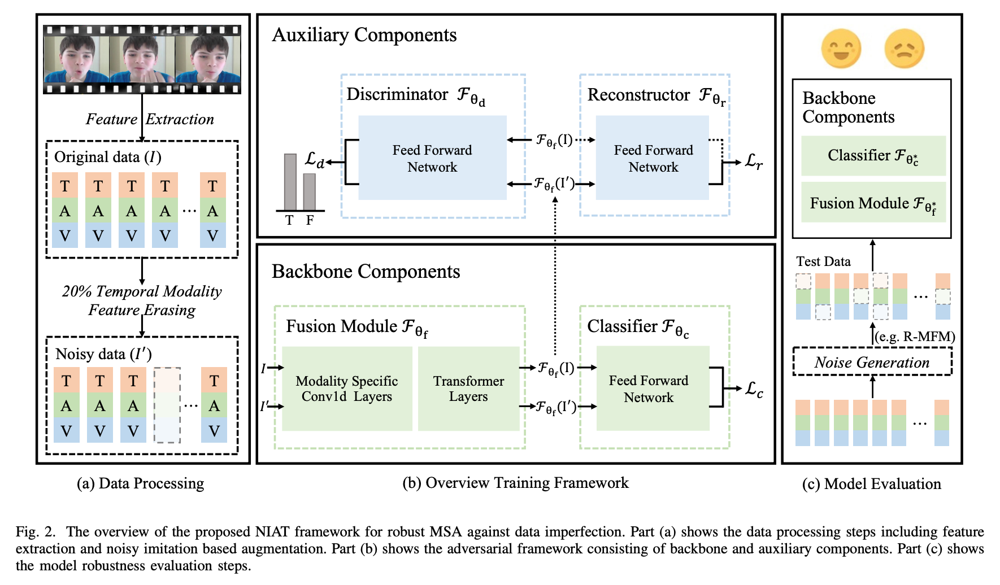

# NIAT
> Pytorch implementation for codes in [Noise Imitation Based Adversarial Training for Robust Multimodal Sentiment Analysis (Accepted by IEEE Transactions on Multimedia)](https://arxiv.org/abs/2102.04830). For baseline method, please see our another repo [MMSA](https://github.com/thuiar/MMSA) for more details, which is a scalable framework for MSA.

## Noise Taxonomy

- **additive disturbance** encompasses all common imperfections in multimodal applications, such as background noise in audio and visual blur in raw video clips.
  - **ASR error** focuses on the imperfection within the predominant linguistic modality based on the fact that transcribed text is noisy and vulnerable to attack.
  - **modality feature missing**, which models imperfections resulting from potential facial detection failure, transmission error with zero padding vectors and unknown word token for text. 

<div align="center">

</div>

## Methodology - NIAT

>  one unified framework capable of achieving robust performance against four distinct forms of potential data imperfections, which include (random, temporal, and structural temporal) modality feature missing, entire modality missing, ASR error, as well as attacks on text modality, simultaneously.



## Usage
For MOSI and MOSEI dataset, you need to download them Using the following link. (aligned_50.pkl).
And Change the root_dataset_dir in __datasetCommonParams in config/config_regression.py.

- [BaiduYun Disk](https://pan.baidu.com/s/1XmobKHUqnXciAm7hfnj2gg) `code: mfet`
- [Google Drive](https://drive.google.com/drive/folders/1A2S4pqCHryGmiqnNSPLv7rEg63WvjCSk?usp=sharing)

For experiment of the asr error and sentiment word replacement, you should download the corresponding data Here.

- [Google Drive](https://drive.google.com/drive/folders/1L7wsUTk5spP_hJRNqTS5sfbOX_40BxwS)

Using the following script to run our codes.

```python
python run.py --modelName niat --datasetName mosi
```

and evaluate the trained model with others type of modality feature missing.

For performance reproduce, we provided the saved model parameters. You should unzip the niat-{mosi/mosei}-method_one-0.2-{111x}.pth file from [Here](https://drive.google.com/drive/folders/1PWL47lviWhFBhklg1HGBEm3APbabmWDh), and place them into saved_models/normals then run the Test.py.


```python
python Test.py --modelName niat --datasetName mosi --noise_type [test_noise_type]
```


### Paper
---
Please cite our paper if you find our work useful for your research:
```latex
@article{yuan2023noise,
  title={Noise Imitation Based Adversarial Training for Robust Multimodal Sentiment Analysis},
  author={Yuan, Ziqi and Liu, Yihe and Xu, Hua and Gao, Kai},
  journal={IEEE Transactions on Multimedia},
  year={2023},
  publisher={IEEE}
}
```
